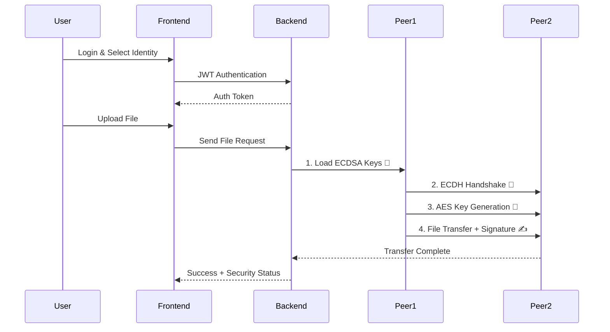

# 🔐 Secure P2P File Transfer System

A modern, secure peer-to-peer file transfer application with end-to-end encryption, digital signatures, and real-time security monitoring.


## 🎥 Demo Video

**[📹 Watch Full Demo](https://drive.google.com/file/d/1P42U0tyUOLteR_qDe991d9aJqM3bqqvL/view?usp=sharing)**

*See the complete secure file transfer process, real-time security monitoring, and user-isolated crypto states in action!*

## 🌟 Key Features

### 🔒 **Advanced Security Architecture**
- **AES-256-GCM Encryption** - Military-grade file encryption
- **ECDH Key Agreement** - Perfect Forward Secrecy for each session
- **ECDSA Digital Signatures** - Tamper-proof authentication
- **JWT Authentication** - Secure API access with role-based permissions
- **Real-time Security Monitoring** - Live crypto operation tracking

### 🚀 **Core Capabilities**
- **Drag & Drop File Upload** with visual feedback
- **Peer-to-Peer Network** with encrypted channels
- **Multi-User Isolation** - Each user has independent crypto states
- **File Directory Browser** with one-click secure downloads
- **Cloud Backup Integration** - Auto-upload to Azure Blob Storage
- **Session Management** - Crypto state cleanup on logout

### 🎨 **Modern User Experience**
- **React TypeScript** frontend with Tailwind CSS
- **Real-time Status Dashboard** updating every 3 seconds
- **Interactive Security Indicators** (🟢 Green = Secure, 🔴 Red = Pending)
- **Responsive Design** for all screen sizes
- **Intuitive Navigation** with tabbed interface

## 🏗️ System Architecture

```
┌─────────────────┐    ┌─────────────────┐    ┌─────────────────┐
│   React Frontend │    │  Spring Boot    │    │   Java P2P      │
│   (TypeScript)   │◄──►│   Backend       │◄──►│   Network       │
│                 │    │                 │    │                 │
│ • SendFile.tsx  │    │ • JWT Auth      │    │ • File Transfer │
│ • FileList.tsx  │    │ • User Mgmt     │    │ • Crypto Ops    │
│ • SecurityUI    │    │ • Crypto API    │    │ • Peer Handler  │
│ • Dashboard     │    │ • File API      │    │ • Key Exchange  │
└─────────────────┘    └─────────────────┘    └─────────────────┘
         │                       │                       │
         └───────────────────────┼───────────────────────┘
                                 │
                    ┌─────────────────┐
                    │  Azure Blob     │
                    │  Storage        │
                    │  (Auto-Backup)  │
                    └─────────────────┘
```

## 🔐 Security Flow



## 🛠️ Technology Stack

### **Frontend (React TypeScript)**
```typescript
// Core Dependencies
React 18.0          // Modern UI framework
TypeScript 5.0      // Type-safe development
Tailwind CSS 3.0    // Utility-first styling
Lucide React        // Beautiful icons
Axios               // HTTP client with interceptors
```

### **Backend (Spring Boot)**
```java
// Backend Stack
Spring Boot 3.0     // Enterprise Java framework
Spring Security     // JWT authentication & authorization
JPA/Hibernate      // Object-relational mapping
MySQL 8.0          // Relational database
Maven              // Dependency management
```

### **P2P Network (Java)**
```java
// Cryptographic Libraries
Bouncy Castle      // Elliptic curve cryptography
Java NIO          // Non-blocking network I/O
ECDSA             // Digital signature algorithm
ECDH              // Key agreement protocol
AES-256-GCM       // Authenticated encryption
```

## 🚀 Quick Start Guide

### Prerequisites
```bash
# Required Software
Java 17+           # Backend runtime
Node.js 18+        # Frontend runtime
MySQL 8.0+         # Database
Maven 3.6+         # Build tool
Git                # Version control
```

### 1. Clone & Setup
```bash
git clone https://github.com/your-username/secure-p2p-auth.git
cd secure-p2p-auth
```

### 2. Database Configuration
```sql
-- Create MySQL database
CREATE DATABASE secure_p2p_db;
CREATE USER 'p2p_user'@'localhost' IDENTIFIED BY 'your_password';
GRANT ALL PRIVILEGES ON secure_p2p_db.* TO 'p2p_user'@'localhost';
```

### 3. Backend Setup
```bash
cd anon-auth-backend

# Configure application.properties
vim src/main/resources/application.properties

# Database settings
spring.datasource.url=jdbc:mysql://localhost:3306/secure_p2p_db
spring.datasource.username=p2p_user
spring.datasource.password=your_password

# JWT settings
app.jwtSecret=mySecretKey
app.jwtExpirationInMs=86400000

# Build and run
mvn clean install
mvn spring-boot:run
```

### 4. P2P Network Setup
```bash
cd keyAgreement

# Generate cryptographic keys (first time only)
mvn compile exec:java -Dexec.mainClass="org.example.KeyGeneration"

# Start peer nodes in separate terminals
mvn compile exec:java -Dexec.mainClass="org.example.Peer1"  # Terminal 1
mvn compile exec:java -Dexec.mainClass="org.example.Peer2"  # Terminal 2
```

### 5. Frontend Setup
```bash
cd frontend

# Install dependencies
npm install

# Start development server
npm run dev
```

### 6. Access Application
- **🌐 Frontend**: http://localhost:3000
- **🔧 Backend API**: http://localhost:8080
- **📡 Peer1**: localhost:5001
- **📡 Peer2**: localhost:5002

## 📱 User Guide

### 🔐 **Getting Started**
1. **Register Account** → Create new user credentials
2. **Login** → Access secure dashboard
3. **Select Identity** → Choose Peer1 or Peer2 role
4. **Monitor Security** → Watch crypto indicators turn green

### 📤 **Sending Files (SendFile.tsx)**
```typescript
// File Upload Process
1. Drag & drop file or click to browse
2. Select target peer (Peer1/Peer2)  
3. Click "Send File Securely"
4. Watch security status update:
   🔑 Keys Loaded → 🤝 ECDH → 🔐 AES → ✍️ ECDSA
```

### 📥 **Downloading Files (FileList.tsx)**
```typescript
// File Download Process
1. Navigate to "File List" tab
2. Browse available files from both peers
3. Click "Request" button on desired file
4. Secure download begins automatically
5. File saved to Downloads folder
```

### 🛡️ **Security Monitoring**
- **🟢 Green Status** = Crypto operation active/completed
- **🔴 Red Status** = Operation pending/failed
- **Auto-refresh** = Status updates every 3 seconds
- **User Isolation** = Each user has independent crypto state

## 🔧 Advanced Configuration

### **Peer Network Ports**
```properties
# Default Port Configuration
peer1.port=5001
peer2.port=5002
backend.port=8080
frontend.port=3000
```

### **Security Settings**
```properties
# Cryptographic Configuration
crypto.algorithm=AES-256-GCM
signature.algorithm=ECDSA-SHA256
key.agreement=ECDH-P256
iv.size=12
key.size=256
```

### **File Upload Limits**
```properties
# Backend File Limits
spring.servlet.multipart.max-file-size=100MB
spring.servlet.multipart.max-request-size=100MB
```

## 🧪 Testing Scenarios

### **End-to-End Test**
1. **Multi-User Test**
   - Register User A and User B
   - Login as User A → Select Peer1 → Send file
   - Logout User A → Login User B → Select Peer2
   - Verify User B has fresh crypto state (not User A's)

2. **Security Verification**
   - Send file → All 4 security indicators turn green
   - Logout → Crypto state cleared on backend
   - Re-login → Only "Keys Loaded" should be green initially

3. **File Transfer Test**
   - Upload various file types (PDF, images, documents)
   - Verify encrypted transfer between peers
   - Confirm files appear in File List
   - Test download functionality

## 🔒 Security Implementation Details

### **Cryptographic Operations**
```java
// Security Pipeline
1. 🔑 ECDSA Key Loading    → Peer authentication setup
2. 🤝 ECDH Key Agreement   → Shared secret establishment  
3. 🔐 AES Key Generation   → Symmetric encryption key
4. ✍️ Digital Signature    → File integrity verification
```

### **User State Isolation**
```java
// Backend Implementation
CryptoService.setKeysLoaded("peer1", "username", true);
// Stores as: "username_peer1" in ConcurrentHashMap
// Each user gets isolated crypto state
```

### **Session Security**
```typescript
// Frontend Logout Process
authService.logout() → {
  fileAPI.clearCryptoStatus(peerIdentity);  // Clear backend state
  localStorage.clear();                     // Clear frontend state
}
```

## 🤝 Contributing

We welcome contributions! Please follow these steps:

1. **Fork** the repository
2. **Create** feature branch (`git checkout -b feature/amazing-feature`)
3. **Follow** coding standards (TypeScript for frontend, Java for backend)
4. **Test** your changes thoroughly
5. **Submit** Pull Request with detailed description

### **Development Guidelines**
- Use **TypeScript** for type safety
- Follow **Spring Boot** best practices
- Implement **proper error handling**
- Add **security considerations** for crypto operations
- Write **comprehensive tests**

## 📄 License

This project is licensed under the **MIT License** - see the [LICENSE](LICENSE) file for details.

## 🏆 Acknowledgments

- **[Bouncy Castle](https://www.bouncycastle.org/)** - Cryptographic library
- **[Spring Boot](https://spring.io/projects/spring-boot)** - Backend framework
- **[React](https://reactjs.org/)** - Frontend library
- **[Tailwind CSS](https://tailwindcss.com/)** - Styling framework
- **[Lucide](https://lucide.dev/)** - Icon library

## 🔗 Project Links

- **📹 [Demo Video](https://drive.google.com/file/d/1P42U0tyUOLteR_qDe991d9aJqM3bqqvL/view?usp=sharing)** - Complete walkthrough
- **📖 [Documentation](../../wiki)** - Detailed guides
- **🐛 [Report Issues](../../issues)** - Bug reports
- **💬 [Discussions](../../discussions)** - Community support

---

<div align="center">

**🔐 Enterprise-Grade Security • 🚀 Modern Architecture • 🌟 Open Source**

**Built with ❤️ by the Secure P2P Team**

⭐ **Star this repo** • 🍴 **Fork & contribute** • 📖 **Read the docs**

*Making secure file transfer accessible to everyone*

</div>
